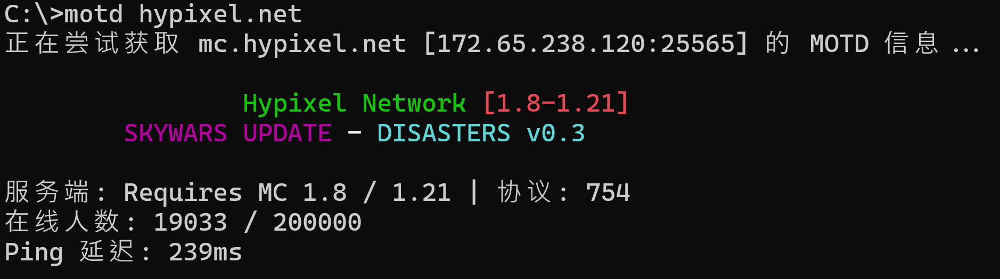

# minecraft-je-motd
[](http://choosealicense.com/licenses/mit/)

`minecraft-je-motd` 是一个用于获取并显示 **Minecraft Java 版** 服务器 MOTD 的命令行工具。它支持 JSON 格式的 MOTD 解析, 包括颜色代码、格式化样式和多行消息的渲染。



## 功能特性

- **获取 MOTD**: 从 Minecraft 服务器检索并显示 MOTD。
- **JSON 解析**: 支持 JSON 格式的 MOTD 解析与显示。
- **颜色与格式支持**: 支持 Minecraft 的颜色代码与文本格式渲染。
- **SRV 记录解析**: 支持对域名的 SRV 记录进行自动解析真实地址和端口。
- **延迟显示**: 显示与服务器的延迟 (Ping) 时间，单位为毫秒。
- **调试模式**: 使用 `--debug` 可查看原始 JSON 和详细的调试信息。

## 使用许可

本项目使用 **MIT License** 开源许可协议, 详情请参阅 [LICENSE](LICENSE) 文件。

## 快速开始

### 1. 安装

1. 从 [Releases](https://github.com/YF-Eternal/minecraft-je-motd/releases) 页面下载最新版EXE。
2. 将 motd.exe 放至任意目录。
3. 可选: 将可执行文件添加到系统 PATH 以便全局使用。

### 2. 使用方式

#### 获取服务器 MOTD

运行以下命令获取服务器的 MOTD 信息：

```bash
motd mc.example.com
```
```text
用法:
    motd [选项] <地址>[:端口] [附加参数]
    (如未指定端口，默认使用 25565)

选项:
    --debug           显示全部 MOTD 信息(包括原始 JSON、彩色样式、纯文本)
    -c, --color       显示彩色 MOTD 样式(默认)
    -p, --plain       显示纯文本 MOTD 样式(适合老旧终端)
    -t, --timeout     设置连接超时等待时间 (默认: 5s, 输入 0 表示直到 TCP 连接超时)
    -h, --help        显示此帮助信息

附加参数:
    -i, --icon [路径]      导出服务器图标为 PNG 文件
                             不指定路径时将保存到桌面 <地址>.png

 示例:
    motd mc.example.com:25565
    motd [fe80:0:0:0:0:0:0:1]:25565
    motd --debug mc.example.com
    motd -t 3 mc.example.com
    motd mc.example.com -i D:/1.png
```
### 3. 开发说明
本项目使用 GO 1.24.3 版本开发。
```bash
go build -ldflags="-s -w" -o motd.exe
```
